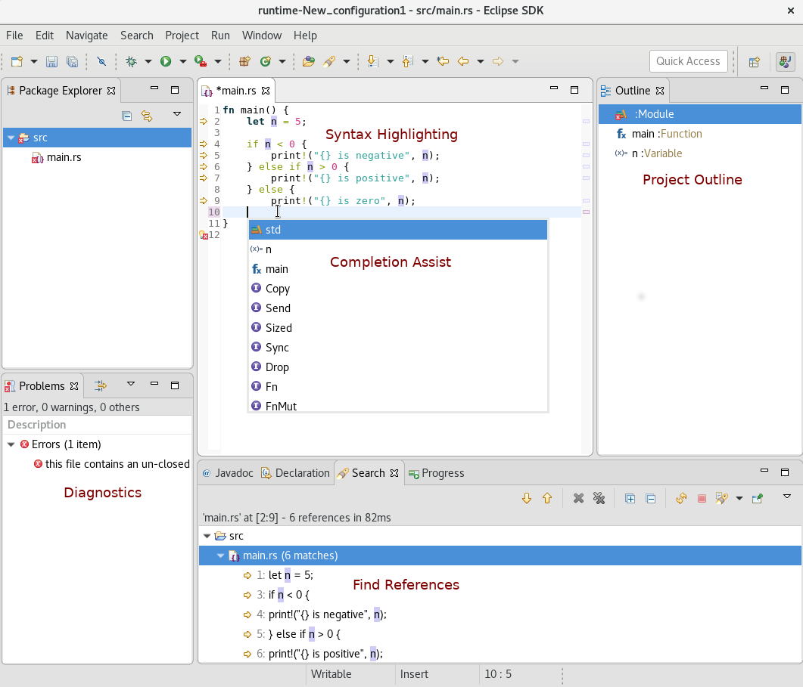

# RedOx
Support for Rust editing in Eclipse IDE.

RedOx (short for reduction–oxidation, the reaction that causes rust), is a Rust development plugin for the Eclipse IDE. Both [issue reports](https://github.com/LucasBullen/redOx/issues) and [pull requests](https://github.com/LucasBullen/redOx/pulls) are greatly appreciated.



## Prerequisites

Rustup is used to install both [Rust](https://www.rust-lang.org/en-US/) and the [Rust Language Server](https://github.com/rust-lang-nursery/rls):
```
curl https://sh.rustup.rs -sSf | sh
```
For other installation options either visit https://rustup.rs/ or use the RedOx preferences page to manually set the required paths.

## Concept

RedOx uses the [lsp4e](https://projects.eclipse.org/projects/technology.lsp4e) project to integrate with the [Rust Language Server](https://github.com/rust-lang-nursery/rls) and [TM4E](https://projects.eclipse.org/projects/technology.tm4e) project to provide syntax highlighting in order to provide a rich Rust editor in the Eclipse IDE.