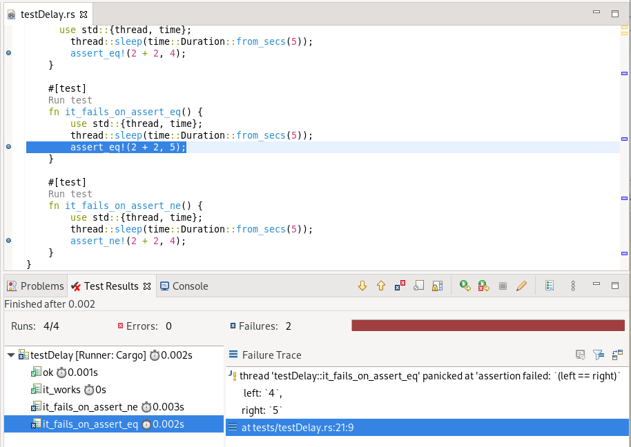
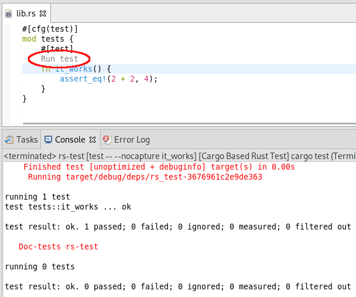

# Corrosion - Releases

## Upcoming Release

### 1.2.0

* 📅 Release Date (tentative): End of February 2020
* All changes: https://github.com/eclipse/corrosion/compare/1.0.0...1.1.0

## Completed releases

### 1.1.1

* 📅 Release Date: February 8th, 2020
* All changes: https://github.com/eclipse/corrosion/compare/1.1.0...1.1.1

#### Addition of a dedicated IDE package

As the "Eclipse IDE for Rust developers" EPP package is being terminated, Corrosion now maintains and ships its own IDE package. It's available at https://download.eclipse.org/corrosion/releases/latest/products .

### 1.1.0

* 📅 Release Date: 4th December 2020
* All changes: https://github.com/eclipse/corrosion/compare/1.0.0...1.1.0

#### Test Report view support

Using the _Cargo Test_ launch configuration will now show the Test Report view to present test progress and failures. This view also provide useful controls to re-run some tests or inspect previous test sessions.

See also [▶️video demo](https://www.screencast.com/t/1sgBo0ENGc).

#### Support Debug for Cargo Tests

The _Cargo Test_ launch can now happen in debug. The children test execution of the `cargo` process are monitored and a debugger is attached when suitable to provide the capability to inspect execution, use breakpoints and so on.

Note that because test can execute very fast, faster than the time it takes to attach a debugger, some tests may seem to be missed. In this case, the test code needs to be tweak to leave time to debugger to be attached, for example with some `std::thread::sleep(std::time::Duration::from_secs(2));` preliminary step.

#### Some Launch Configurations may need review

Some internal change in Launch Configuration may make some pre-existing launch configurtion non-fonctional. In that case, simply review them via the Launch Configuration dialog, and ensure all expected fields are set, and reset them if needed.

### 1.0.0

* 📅 Release Date: 16th September 2020
* All changes: https://github.com/eclipse/corrosion/compare/0.4.2...1.0.0

#### Require Java 11

Corrosion now requires the host IDE to be running with Java 11.

#### "Run Tests" codelens

Added support for the `Run test` CodeLens, allowing execution of single test cases directly from within the code editor.

#### Dependencies and Releng Updates

* TextMate grammar
* Dependencies
* Build machinery

#### Contributors assistance

Added Oomph profile, updated contribution documentation...

## Current Release

### 0.4.2

(not documented)

## Past Release

(previous releases are documented at [documentation/Changelod.md](documentation/Changelod.md))